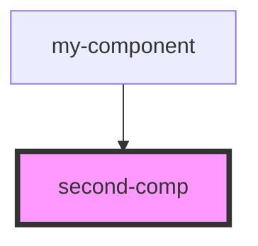

# second-comp

<!-- Auto Generated Below -->

## Properties

| Property   | Attribute   | Description | Type                       | Default                                                |
| ---------- | ----------- | ----------- | -------------------------- | ------------------------------------------------------ |
| `t9n`      | --          |             | `{ [x: string]: string; }` | `{     greeting: 'Hello',     farewell: 'Goodbye'   }` |
| `userName` | `user-name` |             | `string`                   | `undefined`                                            |

## Dependencies

### Used by

 - [my-component](../my-component)

### Graph

----------------------------------------------

*Built with [StencilJS](https://stenciljs.com/)*
